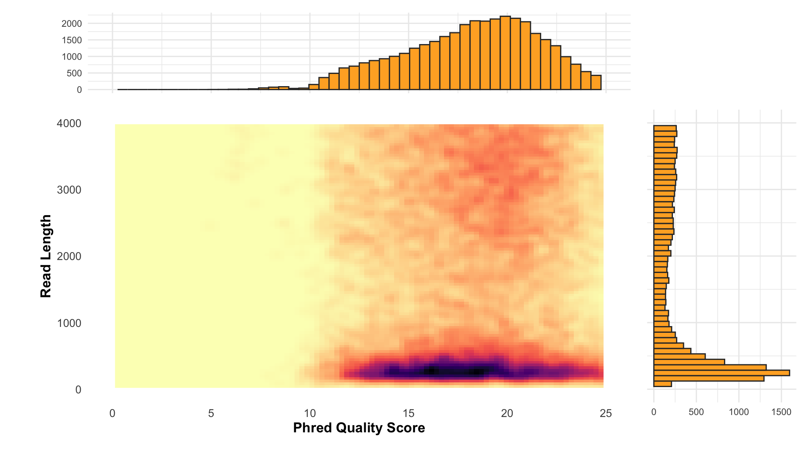

# N50 Calculator

[](https://github.com/quadram-institute-bioscience/n50/actions/workflows/test_n50.yml)
[](https://bioconda.github.io/recipes/n50/README.html)

This repository provides tools for N50 calculation and dataset simulation.

## Main Programs

### `n50`

A command-line tool to calculate the N50 value of a set of sequences.
For detailed usage, refer to the [n50 documentation](docs/README_N50.md).

### `n50_simseqs`

A utility for simulating sequences based on desired lengths.
This is useful for generating test datasets or benchmarking.

### `n50_qual`

For PacBio and Nanopore reads, gather statistics of quality (average, Q20, Q30)
and per read, that can be plotted as:



## General Requirements

- C compiler
- zlib, pthread libraries

## Compiling

```bash
make all
make test
```

## Other Tools

This repository also includes additional tools for specific tasks:

- [`n50_simreads`](docs/README_N50_SIMREADS.md): Simulate reads based on desired lengths.
- [`n50_binner`](docs/README_N50_BINNER.md): Generate a summary of read lengths from a FASTQ file.
- [`n50_generate`](docs/README_N50_GENERATE.md): Generate reads using `n50_simreads` based on `n50_binner` output.
- [`gen`](docs/README_GEN.md): An alternative sequence generator.
- [Benchmark Notes](docs/README_BENCHMARK.md)

## Author

Andrea Telatin, 2023

## License

This program is open-source software released under the [MIT License](LICENSE).

## Contributing

Contributions to improve the N50 Calculator are welcome.
Please submit pull requests or open issues on the project's repository.
Be kind and adhere to the Code of Conduct like the [Contributor Covenant](https://www.contributor-covenant.org/).
